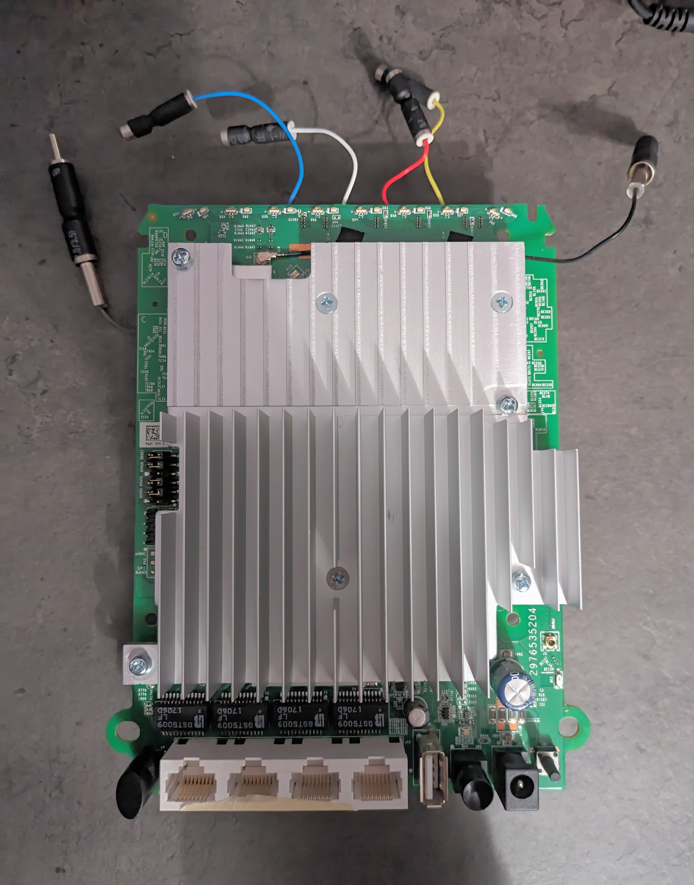
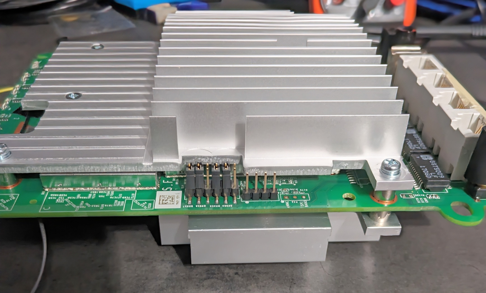
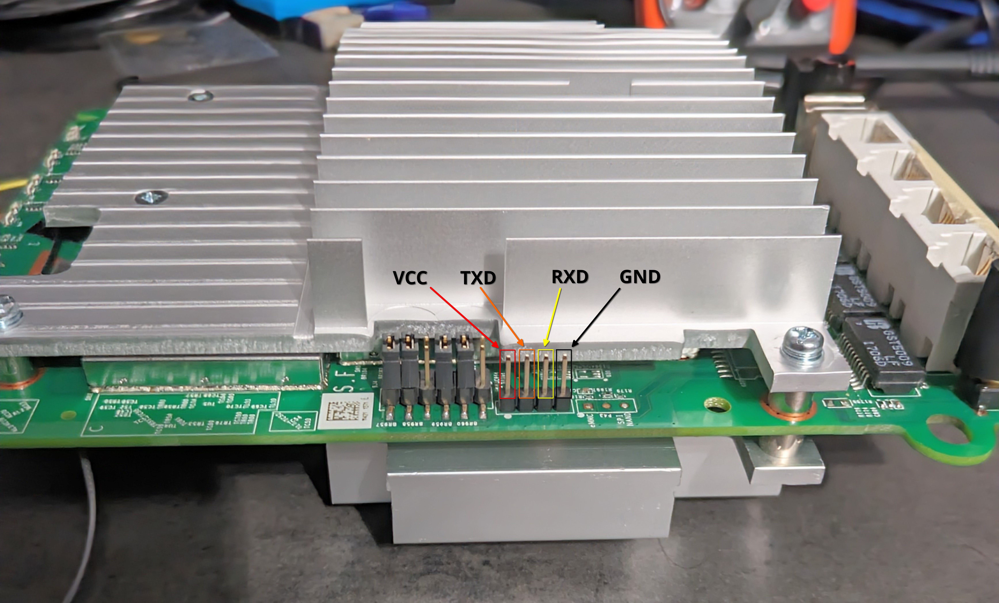

+++
title = 'Orbi Hacking'
date = 2024-05-24T17:08:32-04:00
draft = true
toc = true
+++

## Intro

I have been watching some hardware hacking videos on YouTube recently and wanted to try for it myself. I found two old routers labeled "Orbi." After looking them up, I found that one is the router and the other is called the "satellite" which to my understanding is just another access point. Neither of them were in use, They also hadn't been updated in a while which made them perfect to try hardware hacking for the first time. My main goal was to dump the firmware and look through it at a later date.

## System Details

* Device name: `Netgear Orbi RBR50`
* RAM: `512MB`
* eMMC storage: `4GB`
* Architecture: `armv7l`
* Firmware version: `V2.3.5.30`
* Kernel: `Linux RBR50 3.14.77 #1 SMP PREEMPT`
* U-Boot version: `V2012.07`

## UART

I took the board out of the plastic case but left the heat sinks on it, because I might put OpenWRT on it. I don't want to have to reapply thermal paste later on if I can avoid it. 



I noticed four pins on the left side of the board that i assumed to be UART.



I used a multimeter to check for continuity between the antenna and each pin, I found that the right most pin was continuous, meaning that it was ground. After finding ground, I turned my multimeter to voltage mode and tested each pin from left to right while booting up the router. The left most pin had a constant 3.3V to ground, meaning it was the VCC pin since it was supplying power. The second to the left most pin had a fluctuating voltage to ground, meaning it was the TXD pin because it was sending out data. The second to the right most pin had a  voltage of 0 to ground, meaning it was the RXD pin because nothing was being transmitted through it. This gave me the pinout of:



## Root Shell

I hooked up my UART to USB bridge with the pins and launched [picocom](https://github.com/npat-efault/picocom) with the guess baud rate of 115200.

```
$ picocom -b 115200 /dev/ttyUSB0
```

I hit the power button and got a wall of text of boot messages from U-Boot and the kernel. I noticed the root password getting changed in the wall of text, that is something I will look into later. 

```
Changing password for root
[KC] RBS50 IPP v1.5 Start (Jun  6 2017 17:15:40)
New password: 
Password for root changed by root
Changing password for admin
New password: traffic_meter start : .
```

I waited for the router to finish booting and was dropped into an unrestricted root shell.

## Firmware Extraction

The first thing I did was to run mount to check what parts of the file system were writeable and executable. 

```
root@RBS50:/# mount
rootfs on / type rootfs (rw)
/dev/root on /rom type squashfs (ro,relatime)
proc on /proc type proc (rw,nosuid,nodev,noexec,noatime)
sysfs on /sys type sysfs (rw,nosuid,nodev,noexec,noatime)
tmpfs on /tmp type tmpfs (rw,nosuid,nodev,noatime)
overlayfs:/tmp/overlay on / type overlayfs (rw,relatime,lowerdir=/,upperdir=/tmp/overlay)
tmpfs on /dev type tmpfs (rw,nosuid,relatime,size=512k,mode=755)
devpts on /dev/pts type devpts (rw,nosuid,noexec,relatime,mode=600)
debugfs on /sys/kernel/debug type debugfs (rw,noatime)
/dev/mmcblk0p27 on /tmp/device_tables type ext4 (rw,relatime,data=ordered)
```

Seeing that `/tmp` was writeable and executable it worked as a good place to download  an [arm binary of dd](https://github.com/therealsaumil/static-arm-bins) to use for firmware extraction. 

```
root@RBS50:/# cd /tmp
root@RBS50:~# wget --no-check-certificate https://github.com/therealsaumil/statiD3
c-arm-bins/raw/master/dd-armel-static
--2024-05-24 18:04:06--  https://github.com/therealsaumil/static-arm-bins/raw/master/dd-armel-static
Resolving github.com... 140.82.113.4
Connecting to github.com|140.82.113.4|:443... connected.
WARNING: cannot verify github.com's certificate, issued by 'CN=Sectigo ECC Domain Validation Secure Server CA,O=Sectigo Limited,L=Salford,ST=Greater Manchester,C=GB':
  Unable to locally verify the issuer's authority.
HTTP request sent, awaiting response... 302 Found
Location: https://raw.githubusercontent.com/therealsaumil/static-arm-bins/master/dd-armel-static [following]
--2024-05-24 18:04:06--  https://raw.githubusercontent.com/therealsaumil/static-arm-bins/master/dd-armel-static
Resolving raw.githubusercontent.com... 2606:50c0:8003::154, 2606:50c0:8001::154, 2606:50c0:8002::154, ...
Connecting to raw.githubusercontent.com|2606:50c0:8003::154|:443... failed: Network is unreachable.
Connecting to raw.githubusercontent.com|2606:50c0:8001::154|:443... failed: Network is unreachable.
Connecting to raw.githubusercontent.com|2606:50c0:8002::154|:443... failed: Network is unreachable.
Connecting to raw.githubusercontent.com|2606:50c0:8000::154|:443... failed: Network is unreachable.
Connecting to raw.githubusercontent.com|185.199.111.133|:443... connected.
WARNING: cannot verify raw.githubusercontent.com's certificate, issued by 'CN=DigiCert Global G2 TLS RSA SHA256 2020 CA1,O=DigiCert Inc,C=US':
  Unable to locally verify the issuer's authority.
HTTP request sent, awaiting response... 200 OK
Length: 674832 (659K) [application/octet-stream]
Saving to: 'dd-armel-static'

dd-armel-static     100%[===================>] 659.02K  2.88MB/s    in 0.2s    

2024-05-24 18:04:07 (2.88 MB/s) - 'dd-armel-static' saved [674832/674832]
root@RBS50:~# chmod u+x dd-armel-static
```

From here I needed some way to take the firmware off the device. Luckily the router has a USB port. I formatted a spare USB thumb drive to FAT32 to avoid any possible compatibility issues, then plugged it into the router. The router automatically mounted the USB drive to `tmp/mnt/sda1`. Now that I had a place to put the firmware, I checked for block devices in `/dev`.

```
root@RBS50:~# ls /dev/
atherosgpio         mmcblk0p15          mmcblk0p4           switch_ssdk
bus                 mmcblk0p16          mmcblk0p5           tty
console             mmcblk0p17          mmcblk0p6           ttyMSM0
cpu_dma_latency     mmcblk0p18          mmcblk0p7           ttyQHS0
crypto              mmcblk0p19          mmcblk0p8           ttyS0
full                mmcblk0p2           mmcblk0p9           ttyS1
fuse                mmcblk0p20          mmcblk0rpmb         ubi_ctrl
hwrng               mmcblk0p21          msm_sps             urandom
i2c-0               mmcblk0p22          net                 usblp0
kmsg                mmcblk0p23          network_latency     usblp1
log                 mmcblk0p24          network_throughput  usblp2
mapper              mmcblk0p25          null                usblp3
mem                 mmcblk0p26          port                usblp4
mmcblk0             mmcblk0p27          ppp                 usblp5
mmcblk0boot0        mmcblk0p28          ptmx                usblp6
mmcblk0boot1        mmcblk0p29          pts                 usblp7
mmcblk0p1           mmcblk0p3           random              usblp8
mmcblk0p10          mmcblk0p30          sda                 usblp9
mmcblk0p11          mmcblk0p31          sda1                watchdog
mmcblk0p12          mmcblk0p32          sg0                 watchdog0
mmcblk0p13          mmcblk0p33          shm                 zero
mmcblk0p14          mmcblk0p34          snd
root@RBS50:~# blockdev --getsize64 /dev/mmcblk0
3909091328
```

Knowing the size of the chip on the device is 4GB; it was clear that `mmcblk0` was the entire device's storage. At that point, all I had to do was use dd to copy the block device to my USB drive.

```
root@RBS50:~# /tmp/dd-armel-static if=/dev/mmcblk0 of=/tmp/mnt/sda1/mmcblk0.bin
7634944+0 records in
7634944+0 records out
3909091328 bytes (3.9 GB, 3.6 GiB) copied, 760.989 s, 5.1 MB/s
root@RBS50:~# umount /tmp/mnt/sda1/
```

## Conclusion

The Orbi was quite insecure on the hardware level which made it a great first target to try hardware hacking. I was easily able to extract the entire storage simply by getting into the UART shell. Later on, I'm going to do an in-depth exploration of the firmware image since there were definitely some interesting things i could see at first glance as well as in the boot messages. 
